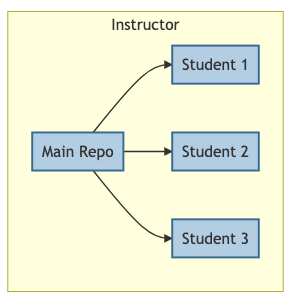

# How it works

GitRoom Manager uses a primary course repository (Master Repo) on your local machine as the basis for each student's personal repository. When seeding/updating student repositories, you are actually 

1. syncing each student's personal directory, hosted on your machine, with the local master repo, and
2. performing git interactions from within those repositories.

Students then have access to their personal repositories via GitHub. They can clone them to their personal machines and interact with the repo as they would any other repo.

# General flow of the class

## (1) Remote student repos to local student repos

The instructor has a new assignment or lesson ready in the master repo to push to the student repositories. To perform a class update, GitRoom Manager will first perform a `git pull` from each student's remote to local repo. This prevents merging issues in the next step.

## (2) Sync local student repos with master course repo

Next, each local student repo is synced with the master course repo using the `rsync` shell command. The command only copies changed files, but will overwrite files with the same name.

## (3) Push local student repos to remote student repos

## (4) Students pull down from remote repos to their local machines

Students interact with their repositories as with any other repository. They can pull down instructor changes and push up their own (*e.g.*, submit assignments).

## (5) Instructor pulls down from student remote repos to grade assignments

As with the first step, the instructor updates the local student repos with their respective remotes. S/he now can inspect student work manually or use the grader function to make quick notes on text files.

# Important Notes  

## Master course directory

Throughout these instructions, I refer to the master course files
as the master course repo(sitory). GitRoom Manager neither requires that the master course directory/files be a git repository nor manages these files, only uses them to update the student repositories.

I assume, however, that most instructors will also want the master course files
to be a git repository. If that is the case, then the user must maintain the master course repository outside of GitRoom Manager as s/he would normally. GitRoom Manager has been built to handle this situation and will ignore certain files/directories, such as the master `.git` directory, when copying from the master to student repos. 

## Student repos hosted locally

Because the basic structure of the program, all student repositories must be hosted locally. This means that the master repository is copied on your local machine *x* times, where *x* is the number of students in the course. GitRoom Manager, therefore, may not be practical for courses with large numbers (> 30) students. Instructors should also consider hosting large binary files or data sets external to the course repository to limit size.

## Instructor files will clobber student files

The default behavior of GitRoom Manager is to overwrite student files with master repo files of the same name. This behavior allows instructors to update lessons or assignments after students have initially received them. The consequence of this decision is that students cannot take notes on lesson files
or complete homework using assignment files (fill in the blank). 

An easy solution is to have students create new files for notes or homework, or rename the original files. The instructor can also include a blank student use directory (*e.g.*, `working`) in the master course repo that s/he promises not to use but instead is for the use of the students.
